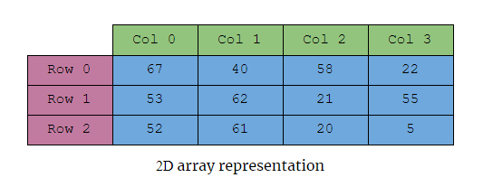

# Sorting 2D Array

Using 2 dimenstional arrays with SPACE is similar to working with regular 
arrays, but there are some minor differences. Lets see how we use SPACE 
in this program to bubble sort a 2d array.

	#include <iostream>
	#include <algorithm>

	// Include space in your program
	#include "space.hpp"

	int main() {
	    const int ROWS = 3;
	    const int COLS = 4;
	    int arr[ROWS][COLS] = {{9, 5, 3, 7}, {2, 8, 1, 6}, {4, 0, 2, 5}};

	    // Save the initial state of the 2d array
	    space::sout("2d array", arr, ROWS, COLS);

	    // bubble sort using std::swap
	    for (int i = 0; i < ROWS * COLS; i++) {
	        for (int j = 0; j < ROWS; j++) {
	            for (int k = 0; k < COLS - 1; k++) {
	                if (arr[j][k] > arr[j][k+1]) {
	                    std::swap(arr[j][k], arr[j][k+1]);

						// Save the 2d array after every swap
	                    space::sout("2d array", arr, ROWS, COLS);

	                }
	            }
	        }
	    }

		// Save the final state of the 2d array
	    space::sout("2d array", arr, ROWS, COLS);

	    return 0;
	}

Heres a breakdown of how we pass arguements to space::sout() when working 
with a 2d array.

> space::sout("2d array", arr, ROWS, COLS);

The first two arguements are the same as with a normal array. First is a 
string which names your data structure in the visualizer. Second is 
the 2d array itself. We still need to tell space::sout() the size of 
our data structure, and because a 2 dimensional array has 2 dimensions its 
size is defined by two values, its length and width, or rows and columns. 
So to tell space::sout() the size of the 2d array we pass it the number of 
rows and columns our 2d array has.

### Saving indicies with 2D arrays

How we save indicies also has to be adjusted to work with 2 dimenstion arrays. 
Lets copy our program above and modify it to save the indicies of the 
bubble sort.

# someone pls check the indicies are correct 

	#include <iostream>
	#include <algorithm>

	// Include space in your program
	#include "space.hpp"

	int main() {
	    const int ROWS = 3;
	    const int COLS = 4;
	    int arr[ROWS][COLS] = {{9, 5, 3, 7}, {2, 8, 1, 6}, {4, 0, 2, 5}};

	    // Save the initial state of the 2d array
	    space::sout("2d array", arr, ROWS, COLS);

	    // bubble sort using std::swap
	    for (int i = 0; i < ROWS * COLS; i++) {
	        for (int j = 0; j < ROWS; j++) {
	            for (int k = 0; k < COLS - 1; k++) {
	                if (arr[j][k] > arr[j][k+1]) {
	                    std::swap(arr[j][k], arr[j][k+1]);

						// Save the 2d array and the bubble sort's indicies
						// after every swap 
	                    space::sout("2d array", arr, ROWS, COLS, j, k, j, k+1);

	                }
	            }
	        }
	    }

		// Save the final state of the 2d array
	    space::sout("2d array", arr, ROWS, COLS, j, k, j, k+1);

	    return 0;
	}

Because each element in the array is defined by a ROW and COL number, each 
index has a ROW and COL number. For example the bubble sort compares 
arr[0][0] with arr[0][1]. So if each index has a ROW and COL value, then 
we need to pass space::sout() *four* values, the ROW and COL index of the 
first element its comparing, and the ROW and COL index of the second 
element its comparing.
