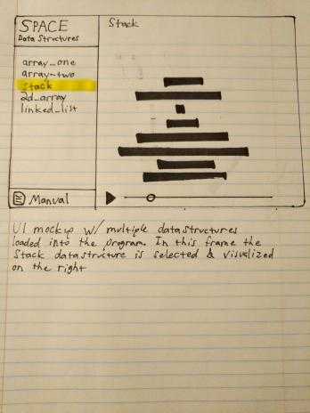

# UI/UX

### Overview

The general layout of our application is a main visualization area on the 
right with a sidebar on the left.

### Functionality

The user may drag a data.json file from their file explorer into the webpage. 
The data structures saved in the data.json file will populate the side bar. 
To visualize a data structure, click one of the elements in the side bar. 
This will fill the visualization pane with a view of that data structure.

### The visualization pane

Hover your mouse over an element to see its value. 
Use the media controls at the bottom to play/pause automatic iteration through 
the save states of your structure. Use the bar to scrub through the save 
states of your structure.

### The side bar

The sidebar contains a list of all data structures present in the data.json 
file. Clicking on one will open it in the visualization pane. Only one 
data structure may be visualized at a time. You can open the SPACE manual 
by clicking the button at the bottom of the side bar.

